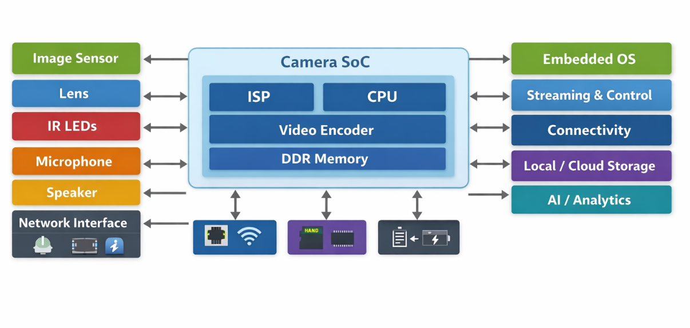
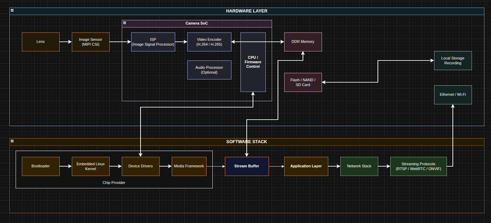

### Embedded Camera System Architecture

An embedded camera system is a tightly integrated combination of **hardware**, **firmware**, and **software**, designed to capture, process, encode, and transmit visual (and sometimes audio) data in real time.
Unlike general-purpose systems, embedded cameras are built with **strict constraints** on power consumption, latency, memory, and cost, while still needing to deliver stable video quality and reliable networking.

At a high level, the architecture typically revolves around:

* A **camera SoC** acting as the central controller
* Dedicated **image processing and encoding pipelines**
* A lightweight **embedded operating system** (usually Embedded Linux)
* Application-level services for streaming, control, and device management

---

### End-to-End Camera Data Flow

The camera data flow describes the full journey of data from the physical world to the network output:

1. **Image Capture**
   Light enters through the lens and is converted into raw pixel data by the image sensor (via interfaces like MIPI CSI).

2. **Image Signal Processing (ISP)**
   Raw data is processed by the ISP to handle demosaicing, noise reduction, white balance, HDR, and color correction.

3. **Video Encoding**
   Processed frames are compressed using hardware encoders (H.264, H.265, etc.) to reduce bandwidth while maintaining quality.

4. **Buffering & Synchronization**
   Encoded video (and audio, if available) is buffered, timestamped, and synchronized for smooth streaming or recording.

5. **Streaming / Storage / Analytics**
   The final data is delivered to its destination: live streaming (RTSP, WebRTC), local storage (SD/NAND), cloud services, or AI/analytics pipelines.

This end-to-end flow must be carefully optimized to avoid bottlenecks, frame drops, or excessive latency.

**overall**:

---

### Hardware and Software Building Blocks

**Hardware building blocks**

* Image sensor, lens, IR-cut, illumination (IR LEDs)
* Camera SoC (CPU, ISP, encoder, memory controller)
* DDR, Flash / NAND / SD storage
* Network interfaces (Ethernet, Wi-Fi)
* Audio components (mic, codec, speaker)
* Power management and peripheral controllers

**Software building blocks**

* Bootloader (SoC initialization, memory, storage)
* Embedded OS (kernel, drivers, device tree)
* Media frameworks (ISP control, encoder, audio)
* Stream Buffer (ringbuffer, IPC)
* Networking stack and streaming protocols
* Device services (configuration, upgrade, logging)
* Application layer (ONVIF, APIs, cloud integration)

**flow**:

Together, these building blocks form a complete, production-ready embedded camera system—where **each layer depends on the stability and correctness of the layers below it**.

---

